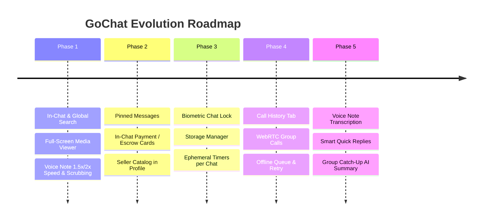

# GoChat — Product Roadmap & Feature Improvements

Comprehensive roadmap for GoChat, elevating it into a world-class, privacy-first messaging and conversational commerce super-app (combining WhatsApp speed, BBM interactivity, and WeChat commerce).

---

## 🧭 Executive Summary & Roadmap Phases



---

## 🚀 Phase 1: Essential Chat & Media Usability (Immediate Impact)

### 1. In-Chat & Global Message Search
- **Overview**: Real-time keyword search across all chats or within an open conversation with highlighting and jump-to-message navigation.
- **User Experience**:
  - Search icon in `ChatRoomActivity` top toolbar opens an in-page search bar with `< Previous` and `Next >` navigation counters (e.g. `3 of 14`).
  - Tapping a search result smoothly scrolls the recycler view directly to the message with a brief highlight pulse.
  - Global search bar in `ChatListFragment` searches both chat titles and message contents, grouped by conversation.
- **Technical Architecture**:
  - Android Room: Add FTS4/FTS5 virtual table on `messages` table for instant local indexed search.
  - Backend: Optional elastic/PostgreSQL `tsvector` query on `chat.messages` for searching messages beyond locally cached history.
- **Checklist**:
  - [x] Add search queries in `ChatDao.kt` (`searchMessagesInConversation`, `searchAllMessages`)
  - [x] Add search toolbar overlay, match counter, and keyword highlighting in `ChatRoomActivity.kt` & `MessageAdapter.kt`
  - [x] Add global debounced message search in `ChatListViewModel.kt`

---

### 2. Full-Screen Media Viewer & Gallery
- **Overview**: Dedicated, immersive viewer for photos and videos with pinch-to-zoom, swipe-to-dismiss, and conversation media browser.
- **User Experience**:
  - Tapping any photo/video bubble opens `MediaViewerActivity` with a sleek black backdrop.
  - Supports smooth pinch-to-zoom, double-tap zoom, swipe-down gesture to dismiss back to chat.
  - Top action bar: Share, Save to device gallery, and View message in chat.
  - "Shared Media, Links & Docs" screen accessible from chat options menu with tabs: *Media*, *Docs*, *Links*.
- **Technical Architecture**:
  - Image handling via custom `ZoomableImageView` and Coil safe loading.
  - Video player using Media3 ExoPlayer (`androidx.media3.exoplayer`).
  - Cache and download files locally in device gallery using `MediaStore` scoped storage and `FileProvider` sharing.
- **Checklist**:
  - [x] Create `MediaViewerActivity.kt` and `ZoomableImageView.kt` with Coil / ExoPlayer integration
  - [x] Add click listeners on image/video containers in `MessageAdapter.kt`
  - [x] Add "Shared Media" 3-tab screen in `SharedMediaActivity.kt`

---

### 3. Voice Note 1.5x / 2x Speed & Waveform Scrubbing
- **Overview**: Interactive playback speed switcher and drag-to-seek scrubbing on voice notes.
- **User Experience**:
  - Pill button next to voice bubble: `1x` ➔ `1.5x` ➔ `2x` ➔ `1x`.
  - User can tap or slide their finger along `WaveformView` to jump to any part of the recording.
  - Smooth visual playback progress indicator synced with `MediaPlayer`.
- **Technical Architecture**:
  - Android `MediaPlayer.setPlaybackParams(PlaybackParams().setSpeed(speed))` (API 23+).
  - Update `WaveformView.kt` with touch event listener (`ACTION_DOWN`, `ACTION_MOVE`) for interactive seeking.
- **Checklist**:
  - [x] Add speed toggle button to voice note layout with cycling speeds in `MessageAdapter.kt`
  - [x] Implement seek-touch gesture in `WaveformView.kt`
  - [x] Bind fractional seeking parameter in `AudioPlayerManager.kt`

---

## 💼 Phase 2: Conversational Commerce & Interactivity

### 4. In-Chat Payment / Escrow Action Cards
- **Overview**: Direct financial interactions inside conversation threads between buyers and sellers.
- **User Experience**:
  - Input bar `+` attachment sheet includes "Request Payment" or "Send Money".
  - Renders a rich card in chat:
    ```
    ┌──────────────────────────────────────────────┐
    │ 💳 Payment Request                          │
    │ Item: Nike Air Max 90                        │
    │ Amount: $120.00                              │
    │ [ PAY NOW ]          Status: PENDING         │
    └──────────────────────────────────────────────┘
    ```
  - Tapping "Pay Now" opens `CheckoutActivity` with card/wallet details.
  - Once paid, WebSocket broadcasts status update to both parties, flipping the card to `PAID` with green checkmark and transaction ID.
- **Technical Architecture**:
  - New `MessageType.PAYMENT_REQUEST` / `MessageType.PAYMENT_RECEIPT`.
  - Go gateway handler `/marketplace/orders/pay` creates payment intent and dispatches WebSocket event `order_paid`.
- **Checklist**:
  - [ ] Add `PAYMENT_REQUEST` to `MessageType.kt` and `MessageAdapter.kt`
  - [ ] Build payment card viewholder in `MessageAdapter.kt`
  - [ ] Wire payment webhook trigger in `services/gateway/handlers/marketplace.go`

---

### 5. Seller Catalog in Contact Profile
- **Overview**: Turn any GoChat user profile into a shoppable storefront.
- **User Experience**:
  - Viewing the profile of a seller displays a "Store / Catalog" carousel under their status bio.
  - Tapping an item opens the product detail with instant "Message Seller" or "Buy Now" CTA.
- **Technical Architecture**:
  - Endpoint `GET /marketplace/products?seller_id={userId}`.
  - Nested horizontal recycler view in `ContactProfileActivity.kt`.
- **Checklist**:
  - [ ] Add `getProductsBySeller` in `MarketplaceRepository.kt`
  - [ ] Add Catalog section in `activity_contact_profile.xml`

---

### 6. Pinned Messages in Conversations
- **Overview**: Pin up to 3 important messages (addresses, rules, payment links) to the top of any chat.
- **User Experience**:
  - Long press any message ➔ "Pin Message".
  - A slim banner docks directly below the chat room toolbar showing the pinned snippet.
  - Tapping the banner scrolls straight to the message; tapping the list icon opens a bottom sheet showing all pinned messages.
- **Technical Architecture**:
  - Add `is_pinned` column to `messages` Room DB table and backend DB.
  - Gateway event `message_pinned` fan-out to conversation members.
- **Checklist**:
  - [ ] Add `isPinned` boolean to `Message.kt` and `ChatDao.kt`
  - [ ] Add collapsible pinned message banner in `activity_chat_room.xml`
  - [ ] Implement pin/unpin action in message context menu

---

## 🔒 Phase 3: Privacy, Security & Data Control

### 7. Biometric Chat Lock (Hidden / Secret Chats)
- **Overview**: Protect sensitive conversations behind fingerprint, face unlock, or PIN.
- **User Experience**:
  - In chat settings: "Lock Chat with Biometrics".
  - Locked chats are moved to a collapsible "Locked Chats" row at the top of the chat list, accessible only after successful biometric prompt (`BiometricPrompt`).
  - Notifications from locked chats hide the message preview ("GoChat: 1 new message").
- **Technical Architecture**:
  - `androidx.biometric:biometric:1.2.0-alpha05`.
  - Room DB flag `is_locked` on `conversations` table.
- **Checklist**:
  - [x] Add `ChatLockManager` with `androidx.biometric:biometric:1.2.0-alpha05` and encrypted preferences
  - [x] Integrate `BiometricPrompt` in `ChatListFragment.kt` and `ChatRoomActivity.kt`
  - [x] Mask last message preview and show lock indicators in `ConversationAdapter.kt`

---

### 8. Storage Management ("Manage Storage")
- **Overview**: Visual storage analyzer showing what's using space with 1-tap bulk cleaner.
- **User Experience**:
  - Settings screen: "Data and Storage" ➔ "Manage Storage".
  - Horizontal bar showing: App Code, Photos, Videos, Audio, Documents, Free Space.
  - Chats sorted by size (e.g. `Family Group — 420 MB`, `Alex — 85 MB`).
  - Tap a chat to multi-select and delete large videos or photos with a live "Free Up X MB" counter.
- **Technical Architecture**:
  - Query local cached files in `context.cacheDir` and `context.getExternalFilesDir()`.
  - Coroutine worker calculating storage usage grouped by `conversation_id`.
- **Checklist**:
  - [x] Create `StorageManagementActivity.kt` and `StorageManagerHelper.kt`
  - [x] Build segmented breakdown chart and chat size ranking (`activity_storage_management.xml`, `item_storage_chat.xml`)
  - [x] Implement batch file deletion utility and wire from Settings

---

### 9. Ephemeral / Disappearing Timer Preset per Chat
- **Overview**: Set auto-deletion duration for all future messages in a conversation.
- **User Experience**:
  - Chat options menu ➔ "Disappearing Messages".
  - Select: `24 Hours`, `7 Days`, `90 Days`, or `Off`.
  - System message inserted into chat: *"Alice set messages to disappear after 24 hours"*.
- **Technical Architecture**:
  - Already have `DisappearingMessageWorker` and `disappearing_messages_duration` in Room DB.
  - Add UI picker dialog in `ChatRoomActivity.kt` and sync setting to backend `PATCH /chat/conversations/:id`.
- **Checklist**:
  - [x] Create duration selection preset dialog and badge in `ChatRoomActivity.kt`
  - [x] Wire duration indicators in `ConversationAdapter.kt` and sync in `ChatRoomViewModel.kt`

---

## 📞 Phase 4: Calling & Real-Time Collaboration

### 10. Call History & Logs Tab
- **Overview**: Dedicated "Calls" screen tracking all VoIP communications.
- **User Experience**:
  - Bottom navigation bar: `Chats` | `Marketplace` | `Stories` | `Calls` | `Settings`.
  - Call list shows: Avatar, Contact Name, Arrow icon (Incoming green, Outgoing blue, Missed red), Timestamp, Call button (Voice / Video).
  - Quick dialer FAB to start a new call with any contact.
- **Technical Architecture**:
  - Local Room DB table `calls` (`id`, `caller_id`, `receiver_id`, `type`, `status`, `duration_seconds`, `created_at`).
  - Ingest call events from WebSocket and FCM incoming call events.
- **Checklist**:
  - [x] Create `CallRecord` Room entity and DAO
  - [x] Create `CallsFragment.kt` and `CallAdapter.kt`
  - [x] Add Calls tab in bottom navigation view

---

### 11. Offline Outbox Queue & Auto-Retry
- **Overview**: WhatsApp-grade offline reliability where messages never get lost when network drops.
- **User Experience**:
  - When offline, messages instantly render with clock icon `ic_status_pending`.
  - When connection is re-established, the background sync queue sequentially delivers all pending messages with zero user intervention.
- **Technical Architecture**:
  - Enhanced `MessageSyncWorker` using Android `WorkManager` with `NetworkType.CONNECTED` constraint.
  - Store un-sent payloads in Room DB with status `SENDING`.
- **Checklist**:
  - [ ] Queue un-sent messages in Room DB on network drop
  - [ ] Register `NetworkMonitor` trigger to flush outbox automatically

---

## 🤖 Phase 5: AI & Smart Productivity

### 12. Voice Note Auto-Transcription
- **Overview**: On-device or cloud speech-to-text transcript under voice notes.
- **User Experience**:
  - Small "Transcribe" button under voice bubbles.
  - Tapping displays an expandable clean text transcript right inside the bubble.
- **Technical Architecture**:
  - Android On-Device Speech Recognizer API or server-side Whisper API.
- **Checklist**:
  - [ ] Add expandable transcript view in `item_message_sent.xml` & `item_message_received.xml`
  - [ ] Connect transcription service in `ChatRepository.kt`

---

### 13. Group Catch-Up AI Summary
- **Overview**: AI digest for active group chats with high volume of unread messages.
- **User Experience**:
  - If a group chat has 25+ unread messages, a floating pill appears: *"✨ Catch up with AI summary"*.
  - Displays a concise 3-bullet summary of topics discussed, decisions made, and mentions.
- **Technical Architecture**:
  - Backend Go endpoint `/chat/conversations/:id/summary` reading unread message slice and generating prompt to Gemini API.
- **Checklist**:
  - [ ] Add `/chat/conversations/:id/summary` endpoint in Go gateway
  - [ ] Add summary dialog in `ChatRoomActivity.kt`

---

## 📊 Quick Implementation Matrix

| Feature | Category | Effort | Priority |
|---|---|:---:|:---:|
| **In-Chat & Global Search** | Chat Core | 🟡 Medium | 🔥 Top Priority |
| **Full-Screen Media Viewer & Gallery** | Media | 🟡 Medium | 🔥 Top Priority |
| **Voice Note 1.5x/2x Speed & Scrubbing** | Audio | 🟢 Low | 🔥 Top Priority |
| **In-Chat Payment Request Cards** | Commerce | 🔴 High | ⚡ High Impact |
| **Pinned Messages** | Chat Core | 🟢 Low | ⚡ High Impact |
| **Biometric Chat Lock** | Privacy | 🟡 Medium | ⚡ High Impact |
| **Call History Tab** | Calling | 🟡 Medium | ⚡ High Impact |
| **Manage Storage Utility** | Data/Device | 🟡 Medium | 💡 Nice-to-have |
| **Voice Note Transcription** | AI | 🟡 Medium | 💡 Nice-to-have |
| **Group AI Catch-up Summary** | AI | 🟢 Low | 💡 Nice-to-have |
